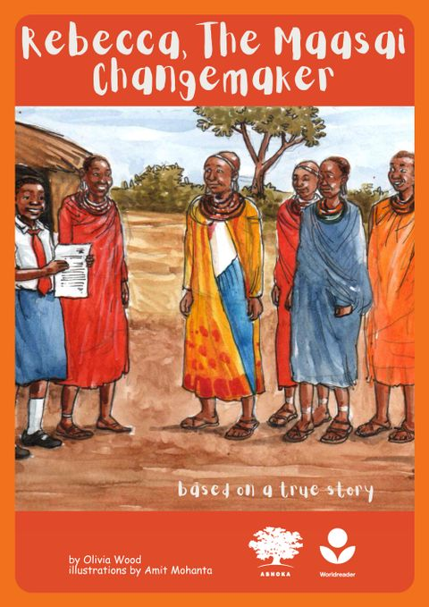

# Rebecca, The Maasai Changemaker (Changemakers)

Written by oliva wood
Published by Worldreader Ashoka

### Description

Rebecca, the maasai changemaker is inspired by the tru story of a young girl in kenya who was alarmed by the signs of climate change in her community. she educated herself about the problem, then galvanized her community and the government to take action.

In the land of the Maasai, in Southwest Kenya, there is a girl named Rebecca.
Rebecca lives near a large national park, where there are golden lions, and big grey elephants.

Rebeccas family keep cattle, sheep and goats and depend on farming the land for food for their animals.
Rebecca goes to school and helps her family care for the animals when she is home.

Source: https://read.worldreader.org/en/Book/Details/af64b2c2-3596-4577-b819-5d1e8fdc2272?version=2

## Table of content
1. [Theme](#theme)
2. [Characters and characterization](#characters-and-characterization)
3. [Plot](#plot)
4. [setting (time, place, ambience)](#setting)
5. [Point of view](#point-of-view)
6. [Moral value](#moral-value)

## Theme
**Climate change** 

## Characters and characterization

- **Rebecca:**

On a hot day in southern Kenya.
Rebecca heard her mother's cry, moaning "this year's agriculture is destroyed, at this rate, our sheep and goats will die". At school, Rebecca tried to learn why such drastic changes in the weather could occur.

The next day Rebecca asked her friends to inform their parents about climate change. Thanks to Rebecca's invitation, parents took action to write a letter to the president of Kenya to make regulations to stop the destruction of nature. In addition, the Maasai community agreed to plant as many trees as possible around them

Conclusion: Rebecca is a child who is affected by climate change. Rebecca knows that the cause of climate change is human activity. Rebecca tries to unite the Maasai community to protect and improve their environment for the safety of all.

- **Rebecca's Mother:**

Rebecca's mother is a farmer and goat herder.
Rebecca's mother helps and supports Rebecca to improve
the environment they are in.

Conclusion: Rebecca's mother supports her daughter's actions to improve the environment around her

- **Maasai community:**

Maasai community is experiencing the same impact of climate change as Rebecca.
Farms were destroyed because there had been no rain for a long time. They agreed that immediate action should be taken to fight climate change.

Conclusion: Maasai community are citizens of Kenya who are affected by climate change and they dare to take action to protect and improve their environment

- **Rebecca Teacher:**

On the day Rebecca started learning about climate change, Rebecca's teacher supported and helped Rebecca understand why climate happens.

<!--## Plot-->

## Setting
**Place :** 
- land of the maasai in southwest kenya
- near a large national park
- house
- school
- libary

**Ambience :** rebecca is so happy
True story of a young girl in kenya who was alarmed by the sign of climate

**Time :** one very hot day, rebecca finds her mama crying
- in just a few days everyone is talking about how human are harming nature
- one day the elders hold a meeting to talk with rebecca

## Point of view

- Rebecca 
1st point of view 

- Rebecca mother 
2nd point of view 

- Rebecca teacher 
2nd point of view 

- Maasai community
2nd point of view 

- Narrator
3rd point of view 

Because the third person point of view can be called as the narrator in the story.

 The second person point of view tells about someone other than the first person point of view

## Moral value
The moral message we get from Rebecca The Maasai's story is almost the same as Michael Jackson's song Heal The World, here are some snippets of lyrics from the song

 There's a place in your heart
 And I know that it is love
 And this place it was brighter than tomorrow
 And if you really try
 You'll find there's no need to cry
 In this place you'll feel there's no hurt or sorrow

 There are ways to get there
 If you care enough for the living
 Make a little space
 Make a better place

 Heal the world
 Make it a better place
 For you and for me, and the entire human race
 There are people dying
 If you care enough for the living
 Make a better place for you and for me

> The song tells how prosperous mankind is if they can love others, the point is "when you do good, no matter what you do, there's a miracle in there"

***

### literature Tim

- M alif angga ansori 2188203094 
- Daniel Dharma Prana 2188203014
- Roselina Maria Narjiani 2188203106
- Yolanda Sela A 2188203055
- Maria Anjelika Dwiyanti (2188203037)
